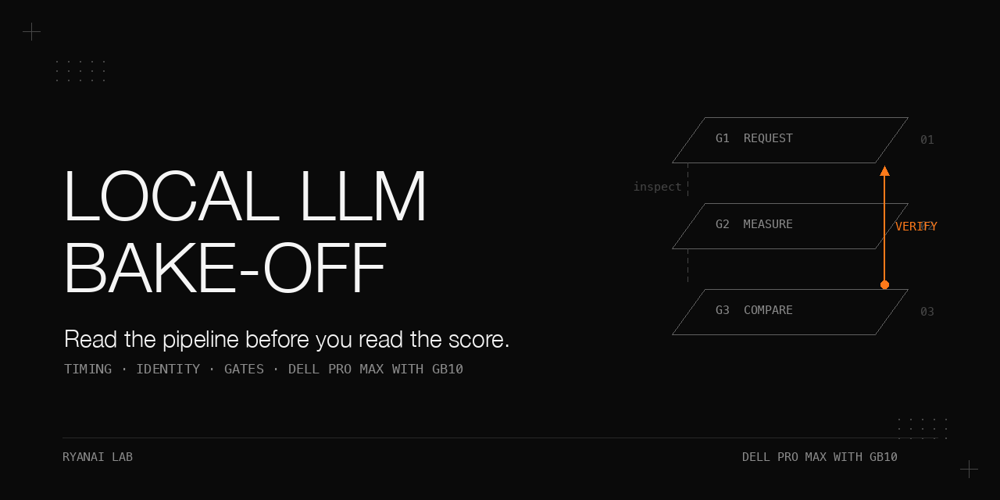

# Local LLM bake-off measurement pitfalls

**Read the pipeline before you read the score.** In a roughly day-long bake-off, and the surrounding evaluations on Dell Pro Max with GB10 machines, every anomalous score we investigated turned out to be a defect in the measurement chain. A cache made prefill look 12.5 times faster; a dead engine became a category score; a requested thinking tier was not the tier served; a shared alias put different weights under a baseline label. This book follows those failures from symptom to mechanism to a mechanical check, then examines the checks that still failed their own audit.

The gates were never used on a new live bake-off. The historical final adversarial audit ended in **FAIL, with 2 medium and 5 low findings open**. The offline tests here validate a public adaptation, not that historical deployment or any model ranking.

## Why this matters

A score is the output of request construction, transport, the serving engine, the chat template, parsing, grading, aggregation and the label on the final table. A failure in any link can masquerade as model ability. An error row averaged as zero and a cached prompt timed as fresh prefill are wrong in opposite directions, but both can influence a hardware or routing decision.

The useful artifact is a check that refuses the misleading comparison, accompanied by evidence about its limits. The historical ledger contained 21 measurement defects: 11 had mechanical guards, 2 had only notes and 8 had neither. Fixing one request path did not fix its siblings. Passing the original incident test did not prove the whole failure class was covered.

## What is in this book

| Chapter | What it answers |
|---|---|
| [1. Triage](docs/triage.md) | Which three signals trigger a pipeline investigation, and which five checks precede comparison? |
| [2. Timing](docs/timing.md) | How do caches, estimated tokens, heartbeat chunks and finished streams corrupt speed measurements? |
| [3. Transport](docs/transport.md) | How do authentication, capacity and engine failures become apparently valid scores? |
| [4. Scoring](docs/scoring.md) | When do truncation, empty comparisons, grader failures and timeouts change the meaning of a score? |
| [5. Recipes](docs/recipes.md) | What makes a recipe official, and how do you verify what reaches the template? |
| [6. Identity](docs/identity.md) | Why can matching aliases and bank hashes still compare different models and arms? |
| [7. Isolation](docs/isolation.md) | How does a route-table gate detect a benchmark sharing production traffic? |
| [8. Usability](docs/usability.md) | Why does a quality finalist need a single-stream latency gate? |
| [9. Audit](docs/audit.md) | What survived mutation testing, and what remained undeployed or unfinished? |

[All tables](docs/results.md), [expanded pitfalls](docs/pitfalls.md) and [implementation and offline procedures](docs/implementation.md) supply the full detail. The evaluation method and runner belong in [ryanai-evalbank](https://github.com/ryangu00/ryanai-evalbank); this book concentrates on diagnosis and gates. Its 2026-10 update receives the authentication, truncation and recipe-gate fixes described here; the published update state has not been independently checked for this book.

## The setting

| Item | Conditions |
|---|---|
| Hardware for the numeric model tables | Dell Pro Max with GB10; 128 GB unified memory per node; two nodes with tensor parallelism 2 over RoCE for vLLM, and one node for an EXL3 build |
| Serving software | Exact image digests and vLLM build were not recorded; the linked stack notes identify a community recipe build of about 0.29 for the winning stack |
| Gateway | LiteLLM 1.99.0 for some runs; used here for routing evidence and request-field handling |
| Grading | Private 11-category bank; pytest 9.1.1 for code categories; tool-eval-bench 2.6.1.dev72 for the three pack categories; no private questions are shipped |
| Named models | Qwen3.8-Flash-Next NVFP4; DeepSeek V4 Flash Vision-Exp on two-node vLLM and single-node EXL3; a pruned 3.0 bits-per-weight text-only EXL3 build of a 284B MoE on one node |
| engine B | An unnamed OpenAI-compatible engine with one resident model, keepalive traffic and its own configuration conventions; no version, platform or measured performance figures are given |
| Time window | First-hand runs: 2026-09-17 to 2026-09-27; main defect hunt: 2026-09-23 and 2026-09-24 |
| Offline reproduction | bash 3.2 or newer, Python 3.10 or newer; no GPU; standard library for core scripts and tests |

Dates, sample sizes and qualifications accompany the tables. If an exact per-run date was not supplied, it remains unspecified. Synthetic fixtures demonstrate failures; they do not recreate the private evaluation or its scores. A real template comparison additionally requires local tokenizer files, optional Transformers and the serving layer's normalized rendering; availability of that last prerequisite on vLLM is unverified.

## 1. Triage before ranking

**Problem.** The first scorecard had a spectacular prefill rate, a coding category near zero and a long-context category near zero. All three represented the pipeline. The summary table hid the per-item `error` field.

**Mechanism and procedure.** Investigate whenever `errors > 0`, one category sits far below that model's others, or a number is too good to be true. Read `raw/<category>-run<k>.jsonl`, then the server log for the same minute, then the relevant request path. Read an HTTPError's body with `e.read()` and retain the first 400 characters; a bare HTTP 400 cannot identify a context-limit rejection. This sequence found the incidents during the first hours; the checklist was written afterwards.

Conditions: early triage during the 2026-09-23 to 2026-09-24 bake-off; the prefill row is the two-node GB10 measurement. No numeric score is published for the other mechanisms.

| Wrong observation | What the evidence showed |
|---|---|
| 64K prefill at 28,894 tok/s | Cache read; corrected nominal result 2,318 tok/s, 12.5 times lower; later usage-based result about 2,725 tok/s |
| Coding category near zero | A separate request path omitted Authorization; requests were rejected |
| Long-context category near zero | The engine did not find its context setting and applied a 32,768-token default |

Before any comparison, put these five questions in its plan:

1. Does truncated thinking arrive in `reasoning_content` or `content`?
2. Is every object compared for equality nonempty?
3. What tier does each template actually apply to the requested effort string?
4. Does a long input exceed the effective context window or local capacity?
5. Is each model using its own recipe, or is this explicitly a uniform control arm?

**What did not work.** Written notes did not stop missing authentication from recurring on another path or the heartbeat mistake from recurring in three places. A plausible aggregate did not clear the raw records.

**Rule.** Read the raw records and server log before ranking an anomalous score. Sweep every sibling consumer after a fix. [Full procedure](docs/triage.md).

## 2. Timing and throughput that were never measured

**Problem.** A fixed generator seed made different lengths share prefixes and repeated passes reuse entire prompts. The first run was discarded, leaving cache reads presented as prefill. A word-count estimate then biased the corrected result in the other direction.

**Mechanism and procedure.** Non-streaming `speed_bench.py` puts a fresh nonce first, uses `usage.prompt_tokens` and `usage.completion_tokens`, drops each tier's first pass and reports the median. Decode uses a short prompt and long output; prefill uses `max_tokens=1`. The historical streaming probe uses a 20-word vocabulary, `n / 1.3` words and seed `n * 1000 + i`, with `temperature=0` and streaming enabled. Stop the TTFT clock only at nonempty content or reasoning, skipping role-only and `model: keepalive` chunks.

Conditions: Qwen3.8-Flash-Next NVFP4, two GB10 nodes, tensor parallelism 2, tier-fixing proxy port, 2026-09-23; four passes per tier, first dropped, median of three; **nominal** denominator.

| Nominal tier | TTFT median (s) | Retained passes (s) | Nominal tok/s |
|---|---|---|---|
| 1,000 | 0.397 | 0.402, 0.397, 0.396 | 2,519 |
| 4,000 | 1.467 | 1.467, 1.467, 1.458 | 2,727 |
| 16,000 | 6.092 | 6.092, 6.085, 6.109 | 2,626 |
| 64,000 | 27.608 | 27.486, 27.756, 27.608 | 2,318 |

The earlier 28,894 tok/s survives in notes, not retained raw output. Prefix caching being enabled by default is a note about that build, not independently rechecked. The 12.5 ratio is 28,894 / 2,318.

Conditions: same pair and model, 2026-09-25 at 01:08 local; three distinct prompts and **server usage** counts; source file retained as a record, generating script not found.

| Pass | Prompt tokens | TTFT (s) | Tok/s |
|---|---|---|---|
| 1 | 63,936 | 23.537 | 2,716.4 |
| 2 | 63,750 | 23.313 | 2,734.5 |
| 3 | 63,836 | 23.437 | 2,723.7 |

The later rate of about 2,725 tok/s implies about 75,000 tokens in the earlier 27.608 s prompt and about a 15 % nominal-denominator underestimate. This is a cross-day, cross-prompt inference, not a token count of the earlier input. `cached_tokens: null` is unknown, not zero; a missing reporting flag is a likely but unverified explanation.

**Other mechanisms.** In the 102-minute single-node EXL3 stress log dated 2026-09-26, nine completed streams carried 2.59 to 2.98 completion tokens per delta. A 32,768-token stream delivered 11,726 deltas, or 2.79 tokens per delta. Finished streams also accumulated `idle_s`, reaching 736 s, while other streams still generated. Use server completion counts and only unfinished streams; confirm stalls against the server's running-request count. [Every stress round](docs/results.md#chapter-2-timing).

**What did not work.** Dropping the cold pass does not flush a prefix cache. Millisecond agreement is not proof of caching: valid corrected passes agree within 1.5 % at 1,000 and 0.6 % at 4,000. A seed from only `(tier, pass)` repeats across invocations. The public streaming rewrite deliberately retains that seed and its nominal denominator, labelled as limitations.

**Rule.** Fresh prompt content, real server token counts and the first real token define a speed measurement. Counting deltas or heartbeats does not. [Timing details](docs/timing.md).

## 3. Transport, configuration and capacity scored as ability

**Problem.** A request failure was written as a zero, then averaged as ability. Container liveness and HTTP success did not prove the engine could answer.

**Mechanism and procedure.** Send authentication on every path, including coding loops and pack subprocesses. Require `choices`, not only HTTP 200. Use a daemon-thread wall-clock deadline because heartbeat bytes reset per-socket-operation timeouts. After a deadline the server may still be working; the driver must restart it and verify readiness before continuing. Restart after configuration edits and probe the effective window. Long-input capacity failures belong in a deployment-capacity-limited list, with concurrency 1, rather than a quality score.

Conditions: two-node DeepSeek V4 Flash Vision-Exp, thinking high, output cap 16,384, two runs, 2026-09-19. The medians below are the **reported error-contaminated values**, not accepted ability estimates.

| Category | Run 1 | Run 2 | Failure evidence | Reported median / spread |
|---|---|---|---|---|
| c10-sre-ops, 30 items | 80.0 | 0.0 | 30 of 30 connection refusals, errno 61; no latency | 40.0 / 80.0 |
| c9-long-coding, 6 repos | 83.3 | 66.7 | 2 of 6 HTTP 500 errors after 673.1 s and 628.1 s | 75.0 / 16.7 |
| c4-code, 12 items | 79.2 | 95.8 | 2 run-1 items truncated at 16,384 | 87.5 / 16.7 |

The reported own-mean was 80.2 including that 40.0. After restoration, two reruns each gave c9 [81.25, 83.33], median 82.3, and c10 [76.7, 83.3], median 80.0. Their bank hash differed because it covered only the categories rerun. Preserve the category list when merging.

**What did not work.** The runner refused categories with no score but still returned numeric 0.0 and exit 0 for in-process categories full of error rows. Refusing every error-contaminated median was specified, not built. A listed model could still return 404 until engine restart. A memory-guard abort could leave later requests receiving 409. Missing tool parsing and dropped images could pass preflight.

**Public check.** `preflight.py` adds parsed-tool-call and image-token-growth checks to the requested extract. They were absent from the historical preflight. A synthetic image-token increase detects a dropped-input shape; it does not establish visual competence.

**Rule.** Authentication, transport and capacity failures invalidate a category. A real generation proves more than `/health` or a model listing. [Failure mechanisms and shell traps](docs/transport.md).

## 4. Scoring rules that credit or hide the wrong thing

**Problem.** One engine left truncated thinking in `content`; a code fence in the draft earned credit. Another left it in reasoning, with empty content. Empty-versus-empty greedy comparisons also looked perfectly identical.

**Mechanism and procedure.** Revoke positive credit whenever `finish == length`, keeping the prior value in `truncated_credit_revoked`. Store both reasoning and content; an empty side makes equality invalid. Record the grader environment and regrade only from full raw bodies through the same grading code. The original repair script had used an answer shortened to 2,000 characters and bypassed the truncation rule.

Conditions: control scan of two-node vLLM raw records; 30 directories, 264 category files; 28 directories dated 2026-09-17 to 2026-09-20 and two dated 2026-09-23. Two directories had raw files but no results file.

| Quantity | Count |
|---|---|
| Scored records | 6,671 |
| Records with a finish field | 6,151 |
| Records with separated reasoning tokens | 1,744 |
| `finish = length` records | 7 |
| Truncated records scored above zero | 0 |

Five distinct items account for the seven records; two code items were duplicated in a corrected merged copy. This scan found no truncation credit on those recorded vLLM finishes; it does not quantify engine B.

Conditions: GB10 c4-code, 12 hidden-test items, run 1 per setting; exact per-row dates not supplied within the recorded run window. Tokens are mean / median / max.

| Model / setting | Output tokens | Mean reasoning | Cap hits | Score |
|---|---|---|---|---|
| Qwen3.8-Flash-Next, thinking off | 132 / 91.5 / 453 | 0 | 0 | 95.8 |
| Same model, requested high through forced-low port | 398 / 324 / 1,033 | 310 | 0 | 95.8 |
| Same model, default thinking, cap 16,384 | 2,708 / 986 / 12,917 | 2,599 | 0 | 95.8 |
| DeepSeek V4 Flash Vision-Exp, thinking off | 81 / 68.5 / 160 | 0 | 0 | 87.5 |
| Same model, thinking high, cap 16,384 | 3,366 / 648.5 / 16,384 | 3,302 | 2 | 79.2 |

At n = 12, one item is 8.3 points; 79.2 versus 87.5 is exactly one item. On the single-node EXL3 long-coding control, two runs scored 81.25 and 96.53, median 88.9. A timeout attribution at 900 s was recorded in notes but not reverified from retained raw bodies. A supplementary single run with 1,800 s scored 98.6; the slowest repository took 525.4 s and 17,481 tokens. The protocol score stayed 88.9. [All six repositories](docs/results.md#chapter-4-scoring).

**What did not work.** Missing pytest could score every hidden test zero. A hard-coded pack concurrency ran 4 when the label said 2. Own categories used 8,000 output tokens while thinking pack categories defaulted to 16,384 unless explicitly set. Strict position matching can penalize an exploratory call; the promised lenient re-score was never built and its bias is unmeasured.

**Rule.** Finished, nonempty outputs and the actual recorded grader are prerequisites to a score. A longer-timeout supplement belongs beside the protocol score, not in its place. [Scoring detail](docs/scoring.md).

## 5. Vendor recipes and effective settings

**Problem.** A uniform recipe of temperature 0.5, top_p 0.95, no top_k, 8,000 output tokens, no system prompt and no reasoning echo had already informed decisions before vendor recipes were checked. That comparison was a control arm.

**Mechanism.** Require a per-model recipe with sampling, chat kwargs, budget, system, echo setting, limitations and field sources. Refuse a missing recipe before creating a run directory, unless `harness-uniform` has an explicit reason. Distinguish `vendor`, `vendor-informed`, `vendor-overridden` and `harness-uniform`. An official label needs a hash-bound `VERIFY*.md` report under the research root and a model-specific verdict.

**Procedure as run.** Recipe research and independent verification were reconciled against first-hand sources and tool code. Acceptance requests checked `choices`. A reasoning-echo proxy required prompt growth of at least 60 tokens, but a two-turn tool-call rendering was needed to catch duplicate or empty thinking blocks. Both assistant turns followed the sole user turn; each required one nonempty block, its marker and byte equality to the official path. Real tokenizer execution on the evaluation host never happened.

Conditions: six model recipes, 74 key fields; exact verification dates not supplied.

| Verdict | Fields |
|---|---|
| Confirmed official | 39 |
| Confirmed but inferred | 24 |
| Refuted | 11 |
| Unverifiable | 0 |

Six refutations changed requests: a serving-layer no-op, duplicate reasoning blocks, an unsupported budget claim, scenario-specific top_p applied globally, an unread `thinking` key, and an omitted scenario field with a 384K cap. Five changed prose. Two verification claims were overturned: the pack's `--timeout 360` was an inter-token gap, not a whole-turn cap; the real outer 3,600 s category timeout needed budget scaling and handling.

Conditions: one pruned 3.0 bits-per-weight text-only EXL3 build of a 284B MoE on one GB10 node; A/B are separate single repetitions on 2026-09-25 / 2026-09-26, control is a two-run median on 2026-09-26; same bank and grader, composite intervention. Vendor-informed: temperature 1.0, top_p 1.0, max effort, 32,768 tokens, echo on. Control: low effort, 0.5 / 0.95 sampling, 8,000 tokens.

| Category | Vendor-informed A | B | Control median | A minus control | B minus control |
|---|---|---|---|---|---|
| c4-code | 95.8 | 95.8 | 87.5 | +8.3 | +8.3 |
| c7-zhif | 90.0 | 86.7 | 68.3 | +21.7 | +18.4 |
| c6-vision, text-only model | 0.0 | 0.0 | 0.0 | 0.0 | 0.0 |
| Own mean, including c6 | 78.5 | 79.2 | 74.0 | | |
| Own mean excluding c6, derived | 89.7 | 90.6 | 84.6 | | |

[The complete category table and control repetitions](docs/results.md#chapter-5-recipes) retain the variation hidden by this excerpt. All six key fields in this vendor arm were non-official because no independent verification report existed. Per-scenario top_p was not implemented. The control spread was 10 points on c2 and c7-zhif. No single-factor ablation identifies whether sampling, tier, budget or echo caused the change; the wall limit also scales by `max(1, max_tokens / 8000)`, giving 4.096 for 32,768.

**What did not work.** Prompt growth passed a duplicate-thinking rendering. Plain-chat history missed templates that retain reasoning only in tool-call turns. Shared configuration edits changed control defaults without verifying whether the engine read the fields. The historical source gate rejected refuted labels but still allowed inferred fields to be relabelled official.

**Rule.** Verify the rendered request and the source of each field. The public source gate adds the missing confirmed-official allow-list; the example remains vendor-informed until independently verified. [Recipes and template behaviours](docs/recipes.md).

## 6. Identity, provenance and same-arm comparison

**Problem.** A column labelled as a two-node baseline carried the model field `deepseek-v4-flash-vision-exp`. The weights behind that shared served alias at the time were Qwen3.8-Flash-Next. This was found after the decision, not by a gate.

**Mechanism and procedure.** Record served identity at run start: model-list entry, reported path or revision, engine mode and timestamp. Compare bank hash, grader hash and environment, arm, sampling, chat kwargs, output budget, system prompt, thinking flag and served identity. Permit a difference only when it is explicitly named and printed. For gateway evaluations, bind to the deployment that answered, not the requested alias; fallback can answer under the original label.

Conditions: the complete worked example is reconstructed from result metadata and the dated switch log. Confidence is high from the timeline, kwargs and labels; no response-level proof was retained.

| Evidence | Recorded value |
|---|---|
| Baseline run | 2026-09-24 22:48 local |
| Model field | `deepseek-v4-flash-vision-exp`, a shared served alias |
| Chat kwargs | `enable_thinking: true`, the Qwen-family key; the other model uses `thinking` and `reasoning_effort` |
| Actual switch to the other model | 2026-09-25 01:10:48; ready 01:14, 2.4 hours after the baseline run |
| Alias note | The one-million-token Qwen3.8-Flash-Next configuration also used that alias, keeping clients unchanged |
| Companion prefill at 01:08 that night | Its label names Qwen3.8-Flash-Next NVFP4; its model field uses the same alias |
| Cutover document | Uses this as the Qwen3.8-Flash-Next baseline for quality parity against that model on another engine |

The baseline also differed from the single-node arm in every field below except bank hash. Exact Python version strings are deliberately withheld, while the environment mismatch is retained.

| Field | Baseline column | Single-node arm |
|---|---|---|
| Bank hash | hash A | hash A, same |
| Grader version hash | hash G1 | hash G2, different code |
| Output budget | 16,384 | 8,000 |
| Thinking control | `enable_thinking: true`, override | `reasoning_effort: low`, override |
| Python environment | environment A | environment B, different version |

The preset gate required own mean and vision each no more than 3 below baseline. Measured gaps were own -4.4, pack -6.4 and vision -7.5, so it failed. The gate was rewritten to own within 5, pack at least 80, vision at least 70 and no new safety failures; the cost was accepted in writing and the original rule retained. That explicit rewrite does not repair a comparison against the wrong model. The same-arm check would refuse it.

Other provenance failures follow the same pattern: requested `high` through a forced-low port produced 398 rather than 2,708 mean code tokens; a label of parallel 2 concealed pack parallelism 4; a warm response omitted a field that had been treated as a routing fingerprint. Routing acceptance used three real calls with the expected deployment API base and zero fallbacks, and a removed alias had to return `Invalid model name`.

**What did not work.** Matching bank hashes, filenames or model fields did not match weights, budgets, grader code or served tiers. A requested alias did not prove its first hop answered.

**Rule.** Record identity and effective settings when the run begins. `check_same_arm.py` enforces the specified fields offline, but cannot authenticate their truth. [Complete provenance discussion](docs/identity.md).

## 7. Do not benchmark on the endpoint serving traffic

**Problem.** A benchmark can evict a resident production model or overload a production fallback engine. Production requests can also contaminate the benchmark. The endpoint can become production after the plan was written.

**Mechanism and procedure.** `prod_gate.py` reads LiteLLM `/model/info`, canonicalizes host spellings numerically without DNS and compares host plus port against every deployment. A hit exits 3 unless a nonblank override reason is recorded. Through a gateway, resolve the alias's deployments first. An unreadable or empty route table records `verified: false` and warns for a direct endpoint; it is not proof of isolation. Service-manager checks were removed from the public extract.

Conditions: GB10 two-node production fallback, 2026-09-25; maximum-effort thinking, 32,768 output tokens, two parallel requests. The full failure log belongs in the linked stack cookbook.

| Observation | Recorded result |
|---|---|
| Throughput reached zero | 03:39:50 local |
| Engine core killed by RPC timeout | 03:44:44 local |
| Container state afterwards | Up, 96 % GPU use |
| Same arm with thinking off | About 2.3 hours without an error |
| Non-thinking report, two runs | Own 87.0, pack 77.8 |
| Valid maximum-effort portion | c1 93.3, c2 90.0, c3 60.0; c4 10 of 12 items |

The evaluation was closed without rerunning that maximum-effort arm on the production fallback. The record described the vendor maximum recipe as killing the engine on this stack; it is a workload-and-stack finding, not a general model claim.

**What did not work.** Written isolation rules, matching only the gateway address, `/health` and container Up status. Numeric loopback spellings are covered, but the machine's LAN address, hostname, tunnel and cross-host equivalence remain open bypasses. The host-health watchdog was specified, not built.

**Rule.** Read the current routes before requesting a model. A known engine-killing workload must not share a production fallback engine. [Isolation cases and limitations](docs/isolation.md).

## 8. Quality rank is not enough: usability

**Problem.** A quality average promoted a model whose wait had never been gated. Tokens per second alone ignored how much the model generated at its recipe tier.

**Mechanism and procedure.** Before a full run, ask the first item from each of c1-kbqa, c4-code, c5-extract, c7-zhif and c10-sre-ops sequentially at the intended recipe. Record wall seconds and output tokens; a deadline is a latency lower bound, other failures are errors. Compute median and inclusive p90 over five samples. Only `INTERACTIVE` at or below 30 s passes; `ERROR`, `NOT_INTERACTIVE` and `UNMEASURED` require an explicit offline-use reason. A relaxed threshold needs a reason too; request timeout is `max(120, 4 x p90 limit)`.

The gate was built and wired after the incident. Replay marked all five historical models unmeasured and unranked. It was never used on a live bake-off. The 30 s threshold is a judgment, not a calibrated value.

Conditions: complete GB10 runs of the same 132 items (30 + 12 + 30 + 30 + 30); token counts only, since recorded wall times were concurrent; exact per-run dates not supplied within the recorded window.

| Model / setting | Median output tokens | Inclusive p90 | Max | Cap hits |
|---|---|---|---|---|
| Qwen3.8-Flash-Next, off | 69.5 | 129 | 453 | 0 |
| Same model, default thinking, cap 16,384 | 284.5 | 1,191 | 12,917 | 0 |
| DeepSeek V4 Flash Vision-Exp, off | 45 | 111 | 182 | 0 |
| Same model, high, cap 16,384 | 125.5 | 589 | 16,384 | 2 |

Illustrative arithmetic only: dividing by separately published single-stream rates of 52.9 and 31.8 tok/s gives Qwen p90 estimates of 2.4 s off and 22.5 s thinking, versus 244 s for its worst item; DeepSeek estimates are 3.5 s off, 18.5 s high and 515 s for a cap-hit item. Prefill, queueing and engine-setting differences are ignored. These are not measured user latencies or live gate passes. [All arithmetic and conditions](docs/results.md#chapter-8-usability).

**What did not work.** Five-sample inclusive p90 gives the slowest value 60 % weight and the next slowest 40 %; it is nearly a maximum and misses long-coding tails. The historical `nan` threshold bypassed comparison. The public extract now requires a finite positive threshold and uses synthetic fast/slow timing fixtures.

**Rule.** Measure the wait before ranking, at the tier to be deployed. Keep token-derived estimates visibly separate from single-stream wall-time measurements. [Usability detail](docs/usability.md).

## 9. Do the gates work?

**Problem.** Passing the author's incident tests did not prove that bad runs could not get through. Relabelled evidence and alternative host spellings escaped.

**Mechanism and procedure.** The historical review covered production isolation, recipe sources, rendering, engine B patch pinning and usability. Independent review wrote mutants and new incident-shaped cases, followed by two fix-and-review rounds. Test evidence and audit verdict were recorded separately.

Conditions: final historical evaluation-gate audit; exact date not supplied. The overall pytest count covers all gate groups and is not this repository's test count.

| Measure | Result |
|---|---|
| Mutants written | 44 |
| Mutants killed | 41; 1 surviving real gap, 2 equivalent mutants |
| Final verdict | Fail: 0 high, 0 medium-high, 2 medium, 5 low |
| Overall gate-group tests | `180 passed` plus script-style tests returning 0; every group still failed final audit |

The medium findings were inferred recipe fields relabelled official and unrecognized production address aliases. The five low findings were an overwrite without backup, an incomplete pinned-patch set, the `nan` threshold bypass, stopping production before patch verification, and a whitespace-reason case covered on only one path. None of the gates had reached the evaluation host at programme end. Tests, replay and later recipe/truncation runs are the evidence; they are not a live bake-off with the complete gates.

**What did not work.** Green tests as acceptance, self-written mutants alone, and fixing only the original spelling. Open work also included modality/tool checks, config-fallback siblings, an old signal trap, the repeated streaming seed, no lenient pack re-score and a coding loop that still swallowed responses without `choices`.

**Rule.** Publish what still slips through. The public allow-list, finite-threshold and modality/tool additions do not retroactively close the historical audit. [Audit and historical status map](docs/audit.md).

## Pitfalls

| Symptom | Root cause | Fix or boundary |
|---|---|---|
| Prefill implausibly fast | Repeated prefix read from cache | Fresh leading nonce; inspect cached-token evidence |
| Speed changes with tokenizer | Nominal words counted as tokens | Server usage counts |
| Preflight never times out | Heartbeat bytes keep socket operations alive | Wall deadline; caller handles server restart |
| Category zero or suspicious median | Authentication or engine errors scored as ability | Read raw errors; invalidate the category |
| Truncated draft earns credit | Grader finds answer-shaped content in unfinished thinking | Revoke credit on `length` |
| Two modes are perfectly identical | Both outputs empty | Store reasoning and content; empty means invalid |
| Recipe labelled official without proof | Gate trusts a copied label | Positive per-field verification allow-list |
| Baseline identity is wrong | Alias survived a model swap | Capture served identity and compare full metadata |
| Isolation appears verified without routes | Empty/unreadable table treated as no hits | Record unverified; unresolved gateway alias refuses |
| Fast model still takes minutes | Long reasoning output ignored | Measure single-stream end-to-end usability |
| All tests pass, review fails | Tests reproduce only the original spelling | Independent mutations and new incident-shaped cases |

[Expanded pitfalls](docs/pitfalls.md) include the driver traps: capture an exit status before command substitution, use an explicit terminating signal trap, append rather than truncate a shared tee output, and do not lexically time-filter untimestamped traceback lines.

## Reproduce it without our infrastructure

1. Use bash 3.2 or newer, Python 3.10 or newer. Work from this repository root. The private bank, engines and GPUs are not needed.
2. Run the default mock suite: `PYTHONDONTWRITEBYTECODE=1 python3 -m unittest discover -s tests -q`. It exercises the real stub handler through in-memory queues; no sockets are opened.
3. Run `python3 scripts/trunc_credit_scan.py fixtures/runs` and `python3 scripts/check_run.py fixtures/runs/synthetic`. Inspect the credited truncation and category error rather than interpreting fixture scores as model performance.
4. Compare the greedy fixtures with `scripts/greedy_compare.py`. The equal pair passes; comparing `fixtures/greedy-empty.json` to itself must report invalid and exit 2.
5. Run `python3 scripts/check_same_arm.py fixtures/arm-a.json fixtures/arm-b.json`. It refuses the grader difference. Add `--intentional grader_version` to print the permitted difference.
6. Load `configs/Qwen3.8-Flash-Next-1M.json` through `scripts/recipe_source_gate.py`; expect `vendor-informed`. Test rendering using `--rendered fixtures/render-good.txt --official fixtures/render-good.txt` with `scripts/recipe_probe.py`, then substitute `render-double.txt` and expect failure.
7. Exercise `scripts/prod_gate.py` with the file route tables. A matching endpoint exits 3, a reason is recorded, and an empty table records unverified. [Exact commands](docs/implementation.md#route-tables-without-sockets).
8. Where loopback binding is permitted, run `scripts/stub_server.py --port 8000` and point the speed, streaming and preflight tools at `http://127.0.0.1:8000/v1`. Or select `RUN_LOOPBACK_TESTS=1` for the same suite. [Full procedure](docs/implementation.md#optional-loopback-demonstration).

The current writing sandbox denied loopback binding; the executed validation uses mocks. Real socket transport, real model rendering and a live bake-off remain unverified here.

## Limits and open questions

- Numerical model evidence is GB10-only; engine B behaviours are version dependent and unquantified here. No re-run of that engine was made for this book.
- Exact image digests and vLLM build are unavailable. Effective configuration, cached-token reporting and template normalization must be checked on the actual server.
- The cross-day prefill correction is implied, the alias finding is metadata-based, and the timeout attribution is recorded but not reverified from raw bodies.
- The recipe sample is one pruned model, one repetition per vendor file and a composite intervention. It cannot establish a general gain or isolate a cause.
- No lenient pack re-score, frozen ranking-rule enforcement, complete error-median refusal, grader-availability refusal or host watchdog was built in the historical programme. The authentication defect's wider historical impact was never measured.
- Five questions and a judgment-based 30 s ceiling are limited latency evidence. Token-derived seconds ignore prefill and queueing and use rates from different runs.
- The public production gate retains its direct-endpoint fail-open record and address-alias gap. Hash-bound recipe evidence still depends on the truth of the verification report.
- The optional re-grader and integration into the external harness are not shipped: its public grader/runner import interface was not supplied. [Implementation boundaries](docs/implementation.md) distinguish this from completed offline code.

## Files

| Path | Contents |
|---|---|
| `docs/results.md` | Complete historical chapter tables, diagnostic mappings and defect-to-gate status map |
| `docs/pitfalls.md`, `docs/<topic>.md` | Expanded failures, mechanisms, procedures, results and public-code boundaries |
| `docs/implementation.md` | Source mapping, offline commands, evidence format and harness integration test contract |
| `scripts/` | Scans, comparisons, preflight, speed probes, recipe and isolation gates, synthetic server |
| `configs/` | Sanitized example recipe with source quotes and placeholder verification |
| `fixtures/`, `tests/` | Synthetic records, route tables, renderings and standard-library tests |
| `docs/make_banner.py` | Banner script; `docs/assets/banner.png` was rendered from it |
| `LICENSE`, `.gitignore` | Supplied templates copied unchanged |

## Related cookbooks

Links locate the named repositories on GitHub; canonical owner URLs were not supplied.

| Repository | Connection |
|---|---|
| [ryanai-evalbank](https://github.com/ryangu00/ryanai-evalbank) | Evaluation method and harness; 2026-10 runner fixes |
| [dell-pro-max-gb10-qwen3.8-flash-next-agentic-thinking](https://github.com/ryangu00/dell-pro-max-gb10-qwen3.8-flash-next-agentic-thinking) | Thinking mode as a measurement setting |
| [dell-pro-max-gb10-dual-node-model-bakeoff-2026-05](https://github.com/ryangu00/dell-pro-max-gb10-dual-node-model-bakeoff-2026-05) | Earlier answer-extractor defect: 70 % to 90 % |
| [dell-pro-max-gb10-vllm-stack-ab](https://github.com/ryangu00/dell-pro-max-gb10-vllm-stack-ab) | Cold prefill, misleading health and the complete engine-death logs |
| [dell-pro-max-gb10-thinking-tier-proxy](https://github.com/ryangu00/dell-pro-max-gb10-thinking-tier-proxy) | Per-port tier forcing and recorded-versus-served settings |
| [dell-pro-max-gb10-zero-downtime-model-swap](https://github.com/ryangu00/dell-pro-max-gb10-zero-downtime-model-swap) | Served-name aliasing across swaps |
| [dell-pro-max-gb10-qwen3.8-flash-next-engine-ab](https://github.com/ryangu00/dell-pro-max-gb10-qwen3.8-flash-next-engine-ab) | Which comparisons pin effort |
| [dell-pro-max-gb10-deepseek-v4-flash-exl3](https://github.com/ryangu00/dell-pro-max-gb10-deepseek-v4-flash-exl3) | Peak reasoning plus answer budget |
| [dell-pro-max-gb10-glm-5.3-flash](https://github.com/ryangu00/dell-pro-max-gb10-glm-5.3-flash) | Running versus usable |
| [training-reranker](https://github.com/ryangu00/training-reranker) | Another weak-model impression caused by the pipeline |

## License

Apache-2.0. See [LICENSE](LICENSE).
